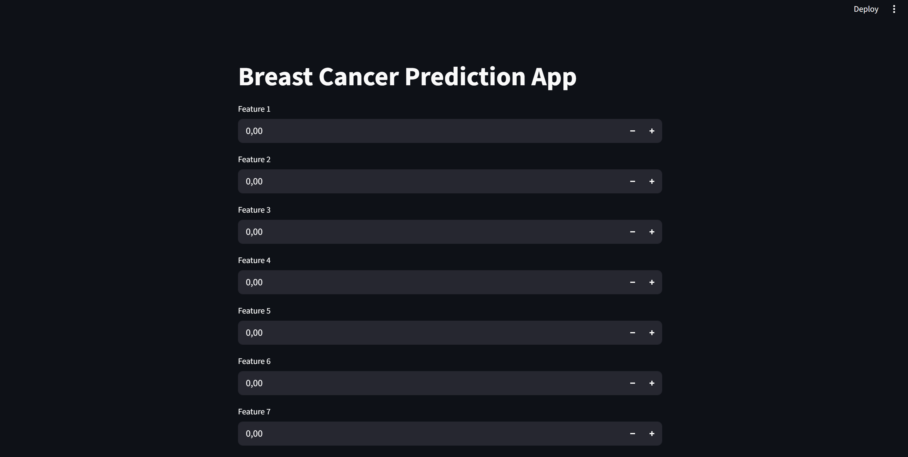
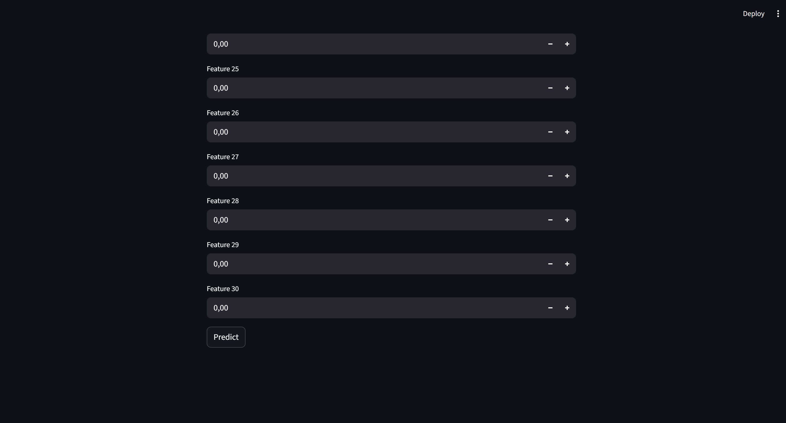
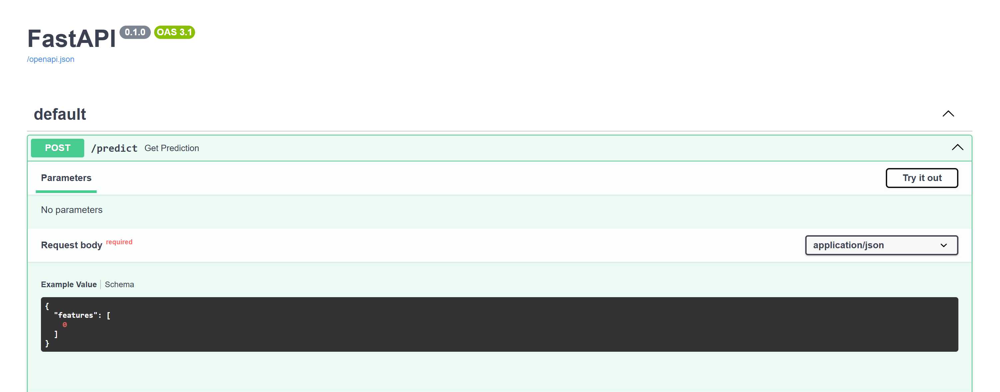
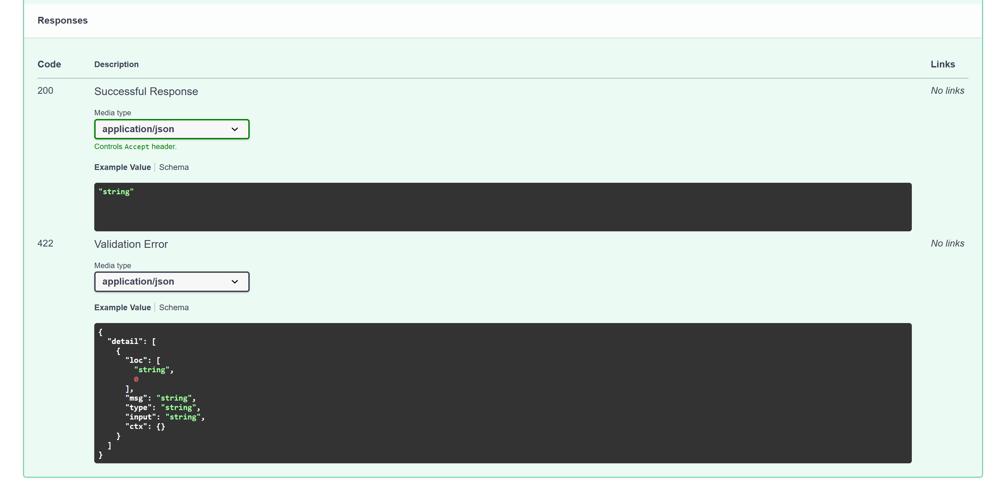

# Breast Cancer Prediction – End-to-End ML Project

## Overview
End-to-end ML pipeline to classify breast cancer tumors (benign vs malignant) using Logistic Regression.

## Tech Stack
- Python, Pandas, Seaborn, Scikit-learn
- FastAPI + Uvicorn (API)
- Streamlit (Frontend)
- Joblib (Model persistence)

## Pipeline
Data → Preprocessing → Model Training → API → Streamlit → Deployment

## How to Run
1. Train model: `python train.py`
2. Run API: `python -m uvicorn api.main:app --reload`
3. Run Streamlit: `streamlit run app.py`

## Screenshots
### Streamlit App

### FastAPI Swagger UI

